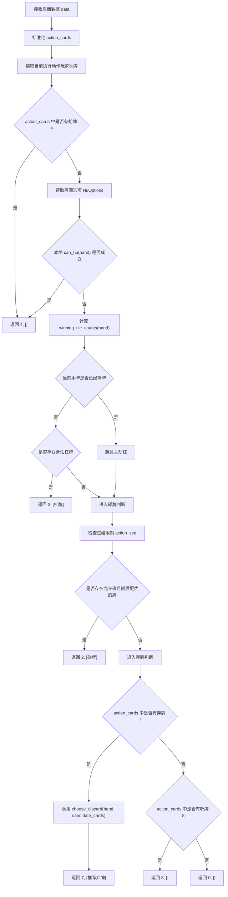
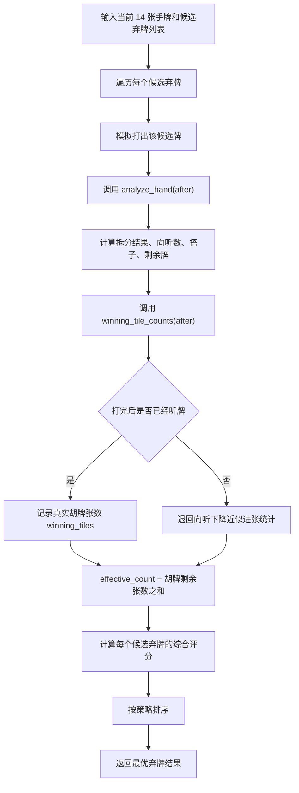

# 九江红中麻将 AI 代码流程图

## 1. 一次推荐动作的总流程

下面的流程图描述的是 `jiujiang_ai/api.py` 中 `get_action(data)` 的一次完整决策流程。

## 2. 推荐出牌的内部流程

当 `get_action(data)` 进入弃牌判断时，会调用 `jiujiang_ai/evaluator.py` 中的 `choose_discard(hand, candidate_cards)`。

## 3. 当前出牌排序策略

`choose_discard()` 当前采用的是偏保守、偏实战可解释的排序思路：

1. 优先选择打出后能够真实进听的牌。
2. 如果多个候选都能进听，则优先选择胡牌张数更多的牌。
3. 在同等条件下，尽量保留红中。
4. 如果都还不能进听，再比较综合评分、有效进张和向听数。

## 4. 当前碰杠决策策略

`get_action()` 中的碰杠逻辑目前采用的是第一版保守策略：

1. 胡牌优先级最高。
2. 如果当前手牌已经听牌，则不主动碰、也不主动杠，优先保持听口。
3. 如果当前还未听牌，则优先判断合法杠牌。
4. 如果没有合适杠牌，再判断碰牌是否能让手牌价值提升。
5. 碰牌前还会检查 `action_seq` 中的过碰限制，避免违反“过碰过圈”规则。

## 5. 一句话总结

九江红中麻将 AI 当前一次推荐动作的主流程可以概括为：

`胡牌优先 -> 本地胡牌兜底 -> 已听牌判断 -> 未听牌时考虑杠 -> 碰牌时检查过碰限制并评估收益 -> 有弃牌候选时做出牌评分 -> 听牌或过`
